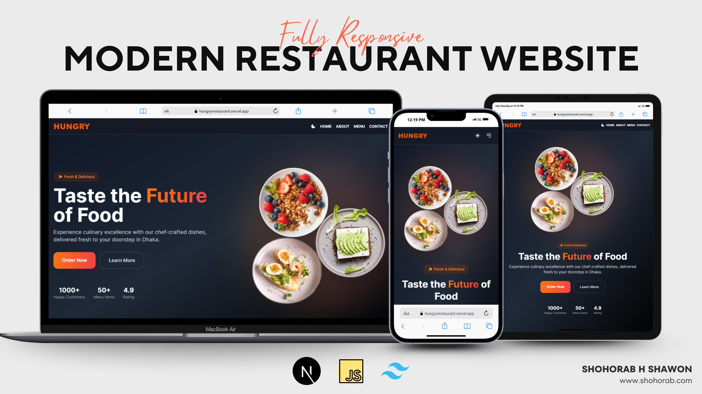

# Hungry - Restaurant Web App


Project is under development...
I'll update after adding every feature.

Hungry is a modern and responsive restaurant web application built with Next.js 14, designed to provide an intuitive and seamless dining experience. This app allows users to explore menus, book reservations, and order food online.

## Table of Contents

- [Features](#features)
- [Demo](#demo)
- [Technologies](#technologies)
- [Installation](#installation)
- [Usage](#usage)
- [Folder Structure](#folder-structure)
- [Contributing](#contributing)
- [License](#license)

## Features

- 🔥 **Responsive Design** – Fully optimized for desktop, tablet, and mobile devices.
- 📋 **Menu Browsing** – Users can explore the menu items, including descriptions, prices, and images.
- 🛒 **Online Ordering** – Customers can place orders directly from the app.
- 📅 **Table Reservations** – Users can book tables in advance.
- 🧑‍💻 **Admin Dashboard** – Restaurant managers can manage menu items, reservations, and orders (planned).
- 🌑 **Dark Mode** – Switch between dark and light themes for a personalized user experience.
- 🚀 **Fast Performance** – Optimized for performance using Next.js and Tailwind CSS.

## Demo

[Live Demo](Project Not Completed)

## Technologies

- **Next.js 14** – Framework for server-rendered React apps.
- **Tailwind CSS** – Utility-first CSS framework for styling.
  ...

## Installation

To get started with Hungry, follow these steps:

1. Clone the repository:

   ```bash
   git clone https://github.com/ShohorabHShawon/Hungry.git
   ```

2. Navigate to the project directory:

   cd hungry

3. Install dependencies:

   npm install

4. Install dependencies:

   npm install

Your app will be available at http://localhost:3000.

I'll update more information after completing the project.
